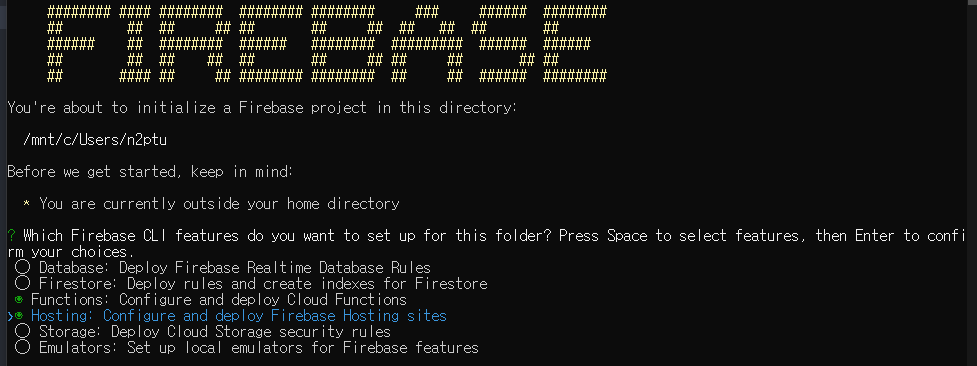
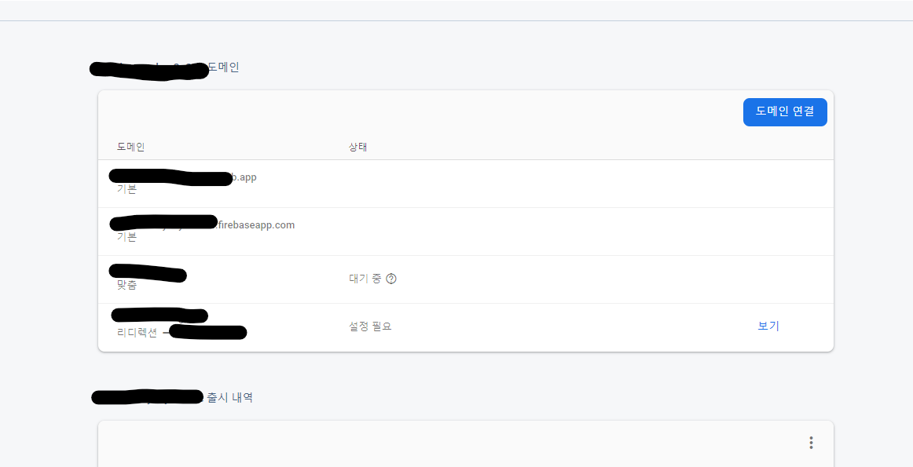

## Firebase

웹에서 크게 두가지 영역을 나누라고 하면 당연지사, 프론트엔드와 백엔드가 있겠죠. 프론트엔드에서 어떤 데이터에 대해 백엔드에 요청해서 백엔드는 그 요청에 해당하는 데이터를 프론트엔드에 다시 응답합니다. 그리고 프론트에서 요청 값으로 알맞게 화면 구성을 합니다.

처음부터 백엔드를 구성하고 사용자들의 인증 상태를 매번 확인하고 데이터베이스에서 데이터를 꺼내와 응답하고 `CORS`에 대응하고 서버를 어디에 띄워놓고 사용할지 등등 고민할 요소가 매우 많습니다. **BaaS(Backend as a Service)**는 이런 백엔드를 미리 구축해놓고 백엔드를 필요로 하는 사용자에게 백엔드의 기능들을 제공하는 서비스입니다.

Firebase도 백엔드를 서비스하는 업체입니다. 이런 기능들을 제공하는 또 다른 업체로 매우 유명한 **AWS**가 있습니다. **AWS**는 서비스도 매우 많고 직접 규칙을 수정할 수 있는 부분도 매우 많고 할 수 있는 것도 매우 많습니다. 그에 반해 Firebase는 정말 웹 서비스에 있어서 핵심적인 부분만 제공합니다. 예를들면 `사용자 인증`, `데이터베이스`, `저장소`, `Cloud Functions`, `정적 파일 호스팅` 이 외에 자세하게는 모르겠지만 `ML Kit`라는 머신러닝에 대한 경험이 없어도 머신러닝 기능을 구현할 수 있게 제공할 수 있는 기능이 있습니다.

이 포스트에서는 `Vue 싱글 페이지 애플리케이션`을 `Firebase Hosting`을 이용해서 배포하고, 커스텀 도메인을 연결해서 나만의 웹 사이트를 구축해보겠습니다.

## Firebase 가입

서비스를 이용하려면 Firebase에 가입해야합니다. 구글에 인수되고 구글 아이디만 있으면 얼마든지 가입이 가능합니다. 가입도 무료고 가입 후 모든 기능은 무료 요금제 한도 내 모두 무료입니다. 요금제는 3개가 있으며 무료 요금제, Flame 요금제, Blaze 요금제가 있습니다.

눈에 띄는 차이점이 하나 있습니다. 다른 요금제에서 서버측에서 코드를 실행해주는 서비스인 `Cloud Functions`는 무료 요금제 한정 **구글에서 제공하는 서비스**에만 접근할 수 있습니다. 구글에서 제공하는 API들에만 접근할 수 있다는 소리죠. 예를 들어 네이버, 카카오 등 다른 Open API 서비스를 활용하지 못합니다.

요금제에 대한 자세한 내용은 [Firebase Pricing](https://firebase.google.com/pricing?hl=ko)을 참고하세요.

[Firebase](https://firebase.google.com/) 왼쪽 링크를 클릭하면 Firebase 홈페이지로 이동됩니다. 이 곳에서 가입한 뒤 콘솔을 사용할 수 있습니다.

## Vue 애플리케이션 만들기

Firebase에 호스팅 시키기 위한 프로젝트를 `vue cli`를 통해 만듭니다.

```sh
vue create test-app
```

설정을 완료하고 설치하면 호스팅 시키기 위한 Vue 프로젝트 준비는 끝났습니다. 따로 Vue 프로젝트에서 설정할 것이 없습니다.

## Firebase 프로젝트 만들기


프로젝트 추가 부분을 눌러 간단한 양식을 작성하고 프로젝트를 만들면 준비 끝입니다. 옵션에 따라 구글이 제공하는 애널리틱스 기능을 간단히 사용할 수 있고 기존의 애널리틱스와 통합 기능을 제공합니다.

프로젝트를 만들고 만들어진 프로젝트로 자동 이동이 됩니다.

## Firebase CLI 설치

Firebase의 모든 기능들을 CLI 환경에서 사용할 수 있도록 모듈을 제공합니다. 아래 명령을 입력해서 모듈을 설치합니다.

```sh
yarn global add firebase-tools
# or
npm i -g firebase-tools
```

사용하는 패키지 매니저로 `firebase-tools`를 설치합니다. 그리고 이 모듈과 Firebase를 연동시켜주기 위해 인증을 해야합니다.

```sh
firebase login
```

자동으로 사이트가 하나 뜨고 로그인이 완료 되면 이제 CLI에서 Firebase 프로젝트에 접근할 수 있게 됩니다. 그 다음, 위에서 만들었던 Vue 프로젝트가 있는 폴더에서 아래 명령어를 실행하고 Firebase 프로젝트를 초기화합니다.

```sh
firebase init
```

Firebase CLI를 제대로 설치하였다면 아래 사진과 같이 뜨게 됩니다.



`Cloud Functions`와 `Hosting`을 사용하기 위해 스페이스바를 눌러 기능을 체크하고 엔터 눌러서 다음 단계로 갑니다.

그러면 몇 가지 입력하는 부분이 나오는데 해당하면 Y 아니면 N을 입력해서 진행하시면 됩니다. JavaScript/TypeScript 둘 중 하나 체크하고, 호스팅 하려는 애플리케이션이 SPA냐고 물어봅니다. 이건 Firebase에서 어떤 경로로 들어오던 `index.html`을 제공할 수 있게 설정할 수 있는 부분입니다. 따로 체크 안해도 나중에 설정이 가능합니다.

입력해서 프로젝트 초기화가 끝났다면 루트 디렉터리에 `firebase.src`, `firebase.json` 파일 2개, `functions/` 폴더 하나가 생겼을겁니다. 여기서, 루트 디렉터리는 Vue 프로젝트고 functions 폴더는 다른 프로젝트라고 생각하시면 됩니다. Vue 프로젝트에서 설치했던 모듈들을 functions에서는 사용하지 못합니다.

## Firebase Functions 기본 설정

다음을 입력해서 `Express`를 설치해서 간단한 응답 함수를 만들어봅시다.

```sh
cd functions
yarn add express
```

주의해야 될 건 `Cloud Functions`는 Node 버전 8과 10만 지원합니다. 로컬 환경의 Node 버전도 이에 맞춰서해야 테스트하기 편할 것 같네요. Node 버전을 쉽게 바꿀 수 있는 모듈인 [n](https://www.npmjs.com/package/n), [nvm](https://github.com/nvm-sh/nvm)이 있으니 참고해보세요. `index.js`를 다음과 같이 수정해줍니다.

```js
const functions = require('firebase-functions')
const express = require('express')
const app = express()

app.get('/', (req, res) => {
  res.set('Content-Type', 'applcation/json')
  res.status(200).send(JSON.stringify({ a: 'aaaa' }))
})

exports.api = functions.https.onRequest(app)
```

아주 간단하게 `/` 라우트에 GET 방식으로 접근하면 JSON을 넘겨줍니다. exports 객체의 속성이 곧 경로가 됩니다. `exports.aaa` = `https://example.com/aaa` 여기서는 `api`라는 경로를 주었으니 `/api`로 오는 요청은 여기서 처리됩니다.

```sh
firebase serve --only functions
```

위 명령어로 배포하기 전 작성한 코드를 테스트해볼 수 있습니다. 이제 아래 명령어를 통해 직접 Firebase에 배포해봅시다.

```sh
firebase deploy
```

명령어 하나면 알아서 지정한 폴더의 정적 콘텐츠를 CDN에 올려줍니다. (dist/) 배포하기 전 Vue 프로젝트를 빌드하세요.



Firebase Hosting 탭을 눌러서 호스팅 부분을 들어오니 자동으로 호스팅되고 Firebase에서 기본으로 제공하는 도메인과 연결되어 있습니다. 해당 주소로 입력해서 들어가면 우리가 빌드한 애플리케이션이 뜹니다.

## Custom Domain 사용하기

Firebase에서 제공하는 도메인 이외에 따로 도메인을 사용하고 싶다면 도메인 연결 버튼을 눌러 지시에 따르면 됩니다. 간단하게 TXT 레코드에 제시하는 값을 넣고 잠시 기다렸다가 확인을 누르면 소유권 확인이 됩니다.

그 뒤 A 레코드에 도메인을 넣고 Firebase에서 제공한 IP 주소를 입력한 뒤 조금만 기다리면 상태가 대기 중이라고 변경되고 얼마 지나지 않아 HTTPS 인증서 적용까지 됩니다. 이 모든 것이 Firebase에서 자동으로 해주는 기능입니다.

경우에 따라 도메인을 리다이렉션해서 사용할 수 있으니 알맞게 사용하시면 됩니다.

## Firebase Hosting 도메인과 Cloud Functions 통합

이 전에 만들었던 서버측에서 실행되는 함수는 **https://us-central1-Project-Name.cloudfunctions.net/api** 꼴의 주소로 이루어져 있습니다. 이 것을 Firebase Hosting에서 지정한 도메인 **https://example.com/api** 형태로 요청이 들어오면 함수를 실행할 수 있게 설정해보겠습니다.

```json
# @/firebase.json

{
  "hosting": {
    "public": "dist",
    "ignore": [
      "firebase.json",
      "**/.*",
      "**/node_modules/**"
    ],
    "rewrites": [
      {
        "source": "/ddd",
        "function": "api"
      },
      {
        "source": "**",
        "destination": "/index.html"
      }
    ]
  }
}
```

`public`은 Vue 프로젝트가 빌드되는 폴더입니다. Firebase는 `rewrites` 속성을 이용해서 지정 경로로 들어오는 경로에 한정해서 재작성 시킬 수 있습니다. 위의 예는 **https://example.com/ddd**로 요청이 오는 경우 `Cloud Functions`의 `api` 함수를 실행시킵니다.

재작성 외 리다이렉션 시킬 수도 있고 매우 많은 속성이 있으므로 [문서](https://firebase.google.com/docs/hosting/full-config)를 참고해서 작성할 수 있습니다.
