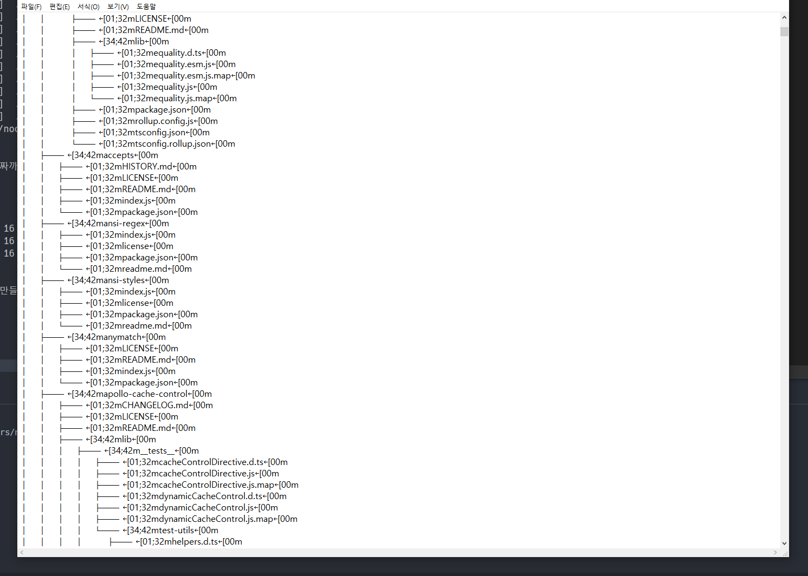

## Linux Tree Install

트리는 **Linux**나 Unix, Mac 뿐만이 아니라 Windows, DOS에서도 사용 가능한 명령어다. 파일 옵션, 정렬 옵션 , 그래픽 옵션 등 다양한 옵션을 지정할 수 있으며 출력 옵션을 변경해서 XML, JSON 그리고 HTML까지 지원한다.

먼저, 이 명령어는 기본 패키지에 포함되어 있지 않으므로 설치해주어야 한다.

```bash
sudo apt install tree
```

## 기본적인 사용법

아무 폴더를 들어가서 `tree -a` 명령어를 실행하게 되면 폴더의 하위 폴더와 파일들을 보기 좋게 포맷해서 출력해준다. 그리고 몇 개의 파일이 있는지, 몇 개의 폴더가 있는지 요약까지 해준다. `-a` 플래그를 이용하면 폴더의 숨겨진 파일까지 모두 출력할 수 있다.

```bash
tree -a
OR
sudo tree -a

...생략...
│       │   ├── index.js.map
│       │   ├── types.d.ts
│       │   ├── types.d.ts.map
│       │   ├── types.js
│       │   ├── types.js.map
│       │   ├── zenObservable.d.ts
│       │   ├── zenObservable.d.ts.map
│       │   ├── zenObservable.js
│       │   └── zenObservable.js.map
│       └── package.json
├── now.json
├── package.json
├── src
│   ├── graphql
│   │   ├── db.js
│   │   ├── resolvers.js
│   │   └── schema.graphql
│   └── index.js
└── yarn.lock

805 directories, 7235 files
```

그 다음은 폴더의 내용들을 모두 출력할 때 파일 이름 앞에 경로 전체가 붙어야할 경우도 있다. `-f` 플래그는 파일 앞에 하위 디렉토리 명을 붙여준다. (path prefix) `-a` 플래그를 붙인 것과 마찬가지로 폴더의 하위 폴더 및 파일들을 출력하는데, 숨겨진 파일이나 폴더는 출력하지 않는다.

```bash
tree -f

...생략...
        │   ├── ./node_modules/zen-observable-ts/lib/index.js.map
│       │   ├── ./node_modules/zen-observable-ts/lib/types.d.ts
│       │   ├── ./node_modules/zen-observable-ts/lib/types.d.ts.map
│       │   ├── ./node_modules/zen-observable-ts/lib/types.js
│       │   ├── ./node_modules/zen-observable-ts/lib/types.js.map
│       │   ├── ./node_modules/zen-observable-ts/lib/zenObservable.d.ts
│       │   ├── ./node_modules/zen-observable-ts/lib/zenObservable.d.ts.map
│       │   ├── ./node_modules/zen-observable-ts/lib/zenObservable.js
│       │   └── ./node_modules/zen-observable-ts/lib/zenObservable.js.map
│       └── ./node_modules/zen-observable-ts/package.json
├── ./now.json
├── ./package.json
├── ./src
│   ├── ./src/graphql
│   │   ├── ./src/graphql/db.js
│   │   ├── ./src/graphql/resolvers.js
│   │   └── ./src/graphql/schema.graphql
│   └── ./src/index.js
└── ./yarn.lock

764 directories, 7029 files
```

파일은 상관없이 폴더의 구조만 보고싶다면? `-d` 플래그를 이용하면 된다. 이 플래그를 붙혀서 명령어를 실행하게 되면, 하위 폴더의 파일은 전부 무시되고 폴더의 이름만 나오게 된다.

```bash
tree -d

│   ├── tslib
│   ├── type-is
│   ├── unpipe
│   ├── user-home
│   ├── util-deprecate
│   ├── utils-merge
│   ├── uuid
│   │   ├── bin
│   │   └── lib
│   ├── v8flags
│   │   └── node_modules
│   ├── vary
│   ├── wrappy
│   ├── ws
│   │   └── lib
│   ├── zen-observable
│   │   ├── lib
│   │   ├── scripts
│   │   ├── src
│   │   └── test
│   │       └── extras
│   └── zen-observable-ts
│       └── lib
└── src
    └── graphql
```

폴더 이름 앞에 경로까지 붙여야 한다면? `-df` 처럼 플래그를 혼합하면 된다.

```bash
tree -df

│   ├── ./node_modules/tslib
│   ├── ./node_modules/type-is
│   ├── ./node_modules/unpipe
│   ├── ./node_modules/user-home
│   ├── ./node_modules/util-deprecate
│   ├── ./node_modules/utils-merge
│   ├── ./node_modules/uuid
│   │   ├── ./node_modules/uuid/bin
│   │   └── ./node_modules/uuid/lib
│   ├── ./node_modules/v8flags
│   │   └── ./node_modules/v8flags/node_modules
│   ├── ./node_modules/vary
│   ├── ./node_modules/wrappy
│   ├── ./node_modules/ws
│   │   └── ./node_modules/ws/lib
│   ├── ./node_modules/zen-observable
│   │   ├── ./node_modules/zen-observable/lib
│   │   ├── ./node_modules/zen-observable/scripts
│   │   ├── ./node_modules/zen-observable/src
│   │   └── ./node_modules/zen-observable/test
│   │       └── ./node_modules/zen-observable/test/extras
│   └── ./node_modules/zen-observable-ts
│       └── ./node_modules/zen-observable-ts/lib
└── ./src
    └── ./src/graphql
```

`-L` 플래그를 이용하면 최대 깊이(depth)를 지정할 수 있다.

```bash
tree -f -L 2

│   ├── ./node_modules/type-is
│   ├── ./node_modules/unpipe
│   ├── ./node_modules/user-home
│   ├── ./node_modules/util-deprecate
│   ├── ./node_modules/utils-merge
│   ├── ./node_modules/uuid
│   ├── ./node_modules/v8flags
│   ├── ./node_modules/vary
│   ├── ./node_modules/wrappy
│   ├── ./node_modules/ws
│   ├── ./node_modules/zen-observable
│   └── ./node_modules/zen-observable-ts
├── ./now.json

tree -f -L 4
│       │   ├── ./node_modules/zen-observable-ts/lib/index.js.map
│       │   ├── ./node_modules/zen-observable-ts/lib/types.d.ts
│       │   ├── ./node_modules/zen-observable-ts/lib/types.d.ts.map
│       │   ├── ./node_modules/zen-observable-ts/lib/types.js
│       │   ├── ./node_modules/zen-observable-ts/lib/types.js.map
│       │   ├── ./node_modules/zen-observable-ts/lib/zenObservable.d.ts
│       │   ├── ./node_modules/zen-observable-ts/lib/zenObservable.d.ts.map
│       │   ├── ./node_modules/zen-observable-ts/lib/zenObservable.js
│       │   └── ./node_modules/zen-observable-ts/lib/zenObservable.js.map
│       └── ./node_modules/zen-observable-ts/package.json
├── ./now.json
```

## 유용한 옵션, 플래그

`-P` 플래그는 와일드 카드 패턴을 이용한 옵션으로, 해당하는 패턴의 파일들만 표시해준다. (특정 확장자만 불러와야할 때 유용)

```bash
tree -f -P *.d.ts

│   ├── ./node_modules/string_decoder
│   ├── ./node_modules/strip-ansi
│   ├── ./node_modules/subscriptions-transport-ws
│   │   ├── ./node_modules/subscriptions-transport-ws/browser
│   │   ├── ./node_modules/subscriptions-transport-ws/dist
│   │   │   ├── ./node_modules/subscriptions-transport-ws/dist/client.d.ts
│   │   │   ├── ./node_modules/subscriptions-transport-ws/dist/defaults.d.ts
│   │   │   ├── ./node_modules/subscriptions-transport-ws/dist/index.d.ts
│   │   │   ├── ./node_modules/subscriptions-transport-ws/dist/legacy
│   │   │   │   └── ./node_modules/subscriptions-transport-ws/dist/legacy/parse-legacy-protocol.d.ts
│   │   │   ├── ./node_modules/subscriptions-transport-ws/dist/message-types.d.ts
│   │   │   ├── ./node_modules/subscriptions-transport-ws/dist/protocol.d.ts
│   │   │   ├── ./node_modules/subscriptions-transport-ws/dist/server.d.ts
│   │   │   └── ./node_modules/subscriptions-transport-ws/dist/utils
│   │   │       ├── ./node_modules/subscriptions-transport-ws/dist/utils/empty-iterable.d.ts
│   │   │       └── ./node_modules/subscriptions-transport-ws/dist/utils/is-subscriptions.d.ts
│   │   └── ./node_modules/subscriptions-transport-ws/typings.d.ts
```

추가적으로, `--prune` 옵션과 `-P` 플래그를 이용하면, 빈 디렉터리를 제외하고 해당 패턴에 일치하는 파일이 존재한 폴더만 출력이 된다. 예를 들면 자바스크립트 파일 확장자를 가진 파일과 폴더만 출력하고 싶다고 하면 다음과 같이 작성하면 된다.

```bash
tree -f -P *.js --prune

│   ├── ./node_modules/arr-diff
│   │   └── ./node_modules/arr-diff/index.js
│   ├── ./node_modules/arr-flatten
│   │   └── ./node_modules/arr-flatten/index.js
│   ├── ./node_modules/array-flatten
│   │   └── ./node_modules/array-flatten/array-flatten.js
│   ├── ./node_modules/array-unique
│   │   └── ./node_modules/array-unique/index.js
│   ├── ./node_modules/async-each
│   │   └── ./node_modules/async-each/index.js
│   ├── ./node_modules/async-limiter
│   │   ├── ./node_modules/async-limiter/coverage
│   │   │   └── ./node_modules/async-limiter/coverage/lcov-report
│   │   │       ├── ./node_modules/async-limiter/coverage/lcov-report/prettify.js
│   │   │       └── ./node_modules/async-limiter/coverage/lcov-report/sorter.js
│   │   └── ./node_modules/async-limiter/index.js
```

`-h` 플래그는 파일의 사이즈를 출력해주는 플래그다. 비슷한 플래그로 `-s` 플래그가 있지만 `-h` 플래그가 좀 더 읽기 쉽다.

```bash
tree -f -h

│       │   ├── [ 395]  ./node_modules/zen-observable-ts/lib/bundle.cjs.js
│       │   ├── [ 322]  ./node_modules/zen-observable-ts/lib/bundle.cjs.js.map
│       │   ├── [ 167]  ./node_modules/zen-observable-ts/lib/bundle.esm.js
│       │   ├── [1.5K]  ./node_modules/zen-observable-ts/lib/bundle.esm.js.map
│       │   ├── [ 771]  ./node_modules/zen-observable-ts/lib/bundle.umd.js
│       │   ├── [1.5K]  ./node_modules/zen-observable-ts/lib/bundle.umd.js.map
│       │   ├── [ 144]  ./node_modules/zen-observable-ts/lib/index.d.ts
│       │   ├── [ 186]  ./node_modules/zen-observable-ts/lib/index.d.ts.map
│       │   ├── [ 297]  ./node_modules/zen-observable-ts/lib/index.js
│       │   ├── [ 152]  ./node_modules/zen-observable-ts/lib/index.js.map
│       │   ├── [ 709]  ./node_modules/zen-observable-ts/lib/types.d.ts
│       │   ├── [ 794]  ./node_modules/zen-observable-ts/lib/types.d.ts.map
│       │   ├── [ 110]  ./node_modules/zen-observable-ts/lib/types.js
│       │   ├── [ 102]  ./node_modules/zen-observable-ts/lib/types.js.map
│       │   ├── [1.2K]  ./node_modules/zen-observable-ts/lib/zenObservable.d.ts
│       │   ├── [1.8K]  ./node_modules/zen-observable-ts/lib/zenObservable.d.ts.map
│       │   ├── [ 272]  ./node_modules/zen-observable-ts/lib/zenObservable.js
│       │   └── [ 164]  ./node_modules/zen-observable-ts/lib/zenObservable.js.map
│       └── [1.6K]  ./node_modules/zen-observable-ts/package.json
```

`-D` 옵션은 최종 수정 날짜까지 출력해준다.

```bash
tree -f -h -D

│   │   ├── [1.0K Feb 16 13:00]  ./src/graphql/db.js
│   │   ├── [ 281 Feb 16 13:00]  ./src/graphql/resolvers.js
│   │   └── [ 275 Feb 16 13:00]  ./src/graphql/schema.graphql
```

`-o` 옵션은 트리 형태로 만들어진 이 출력 형식을 파일로 만들어준다.

```bash
tree -o tree.txt
```



`-I` 옵션은 가장 유용할 것이라 생각한다. 뒤에 오는 와일드 카드 패턴을 Ignore해서 표시해준다. 다음은 **node_modules** 폴더와 **\*.txt** 확장자를 Ignore 하는 방법이다.

```bash
tree -I "node_modules|*.txt"

├── README.md
├── build
│   ├── graphql
│   │   ├── db.js
│   │   └── resolvers.js
│   └── index.js
├── now.json
├── package.json
├── src
│   ├── graphql
│   │   ├── db.js
│   │   ├── resolvers.js
│   │   └── schema.graphql
│   └── index.js
└── yarn.lock

4 directories, 11 files
```

Linux Tree 끝

## 참고

- [https://www.tecmint.com/linux-tree-command-examples/](https://www.tecmint.com/linux-tree-command-examples/)
- [https://www.lesstif.com/pages/viewpage.action?pageId=54952142](https://www.lesstif.com/pages/viewpage.action?pageId=54952142)
- [https://github.com/tldr-pages/tldr/blob/master/pages/linux/tree.md](https://github.com/tldr-pages/tldr/blob/master/pages/linux/tree.md)
