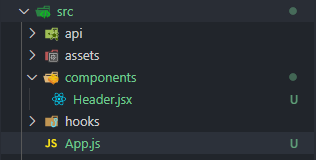

## 절대 경로

한 파일에서 다른 파일을 가져오기 위해서 자바스크립트에서는 `import` 구문 혹은 `require`을 사용한다. 리액트(Creact React App)에서는 웹팩과 바벨 설정을 기본적으로 해주어 `import` 구문을 사용할 수 있게 해준다. 이 때 가져오려는 파일과 현재 위치가 매우 멀다면 끔찍한 임포트 지옥을 맛보게 된다.

```js
import SomeComponent from '../../../../../../../../../../some-directory/component'
```

한 눈에 봤을 때 저 폴더가 어디 폴더인지 가늠이 가지도 않고 폴더를 찾는데에만 지루한 시간을 보낼 수도 있다. (매우 극단적인 예이긴 하다) Vue에서는 이런 방법을 `vue.config.js`를 직접 수정해 `alias`을 건드리면 아래와 같이 접근하는게 가능해진다.

```js
import SomeComponent from '@/components/blah/blah-blah/some-directory/component'
```

앞서 나왔던 끔찍한 임포트 지옥에서 나온 경로보다 훨씬 깔끔하고 모두 폴더 이름으로 되어 있기 때문에 어디에 존재하고 무슨 동작을 하는 컴포넌트인지 대충 가늠이 간다.

### 문서에 나와있는 대로

절대 경로를 사용하는 방법으로 웹팩 설정을 건드려야 한다고 생각하여 리액트에선 쉽지 않은 일이 될 것 같다. 라고 생각했었는데 친절하게도 [문서](https://create-react-app.dev/docs/importing-a-component/#absolute-imports)에서 방법을 설명해주었다.

프로젝트 루트에 `jsconfig.json` 또는 타입스크립트를 사용하고 있다면 `tsconfig.json`을 만든다. 이미 있다면 몇 가지 속성만 추가해주면 된다.

```json
{
  "compilerOptions": {
    "baseUrl": "src"
  },
  "includes": ["src"]
}
```

위의 6줄만 추가해주면 절대 경로를 리액트에서 사용할 수 있다.



만약 위와 같은 폴더 구조가 있으면, `App.js`에서 다음과 같은 임포트 구문이 가능해진다.

```js
// App.js
import Header from 'components/Header'
import { useHooks } from 'hooks/some'
import { getUserProfile, getUserAvatar } from 'api/uesr/fetch'
import 'assets/acc.scss'

function App() {
  return (
    <div>
      <Header />
    </div>
  )
}

export default App
```

물론 컴포넌트에서도 위와 같은 경로로 다른 파일을 임포트할 수 있다.

```js
// components/SomeComponent.js
import React from 'react'
import { useHooks } from 'hooks/some'

function SomeComponent() {
  return <div>Some Component</div>
}

export default SomeComponent
```

### 삽질

#### NODE_PATH

`NODE_PATH`를 `src`로 지정하여 빌드와 개발 서버를 여는데 사용하는 방법이 있다. 아래와 같이 사용하면 된다. 사용하기 전 `cross-env`를 먼저 설치한다.

```sh
yarn add --dev cross-env
```

그 다음 `package.json`의 `build` 스크립트와 `start` 스크립트를 수정한다.

```json
{
  "scripts": {
    "start": "cross-env NODE_PATH=src react-scripts start",
    "build": "cross-env NODE_PATH=src react-scripts build"
  }
}
```

위 방법은 향후 없어질 방법(혹은 이미 없어진 방법)이므로 정상적으로 동작하지 않을 수도 있다. 비교적 최신 버전의 리액트를 사용하면 아래와 같은 경고 문구가 뜬다.

```sh
Setting NODE_PATH to resolve modules absolutely has been deprecated in favor of setting baseUrl in jsconfig.json (or tsconfig.json if you are using TypeScript) and will be removed in a future major release of create-react-app.
```

`NODE_PATH`를 지정하여 절대 경로를 구성하는 방법은 사라질 것이니 앞서 나온 방법인 `jsconfig.json` 혹은 `tsconfig.json`을 수정하여 사용하라는 문구이다.

#### CRA가 아닌 환경

CRA(Create React App)이 주는 간편함과 자동으로 해주는 기초 설정(Webpack, Babel, ESLint, 등등)을 버리고 `eject`를 해버린다거나 아니면 CRA을 사용하지 않고 아무것도 없는 맨땅에서 리액트를 시작하는 환경에서는 CRA에서 웹팩 설정을 건드리는 일보다 훨씬 자유롭다.

이런 환경에서는 2가지만 생각하면 된다.

- 에디터에서의 경로 추적 지원
- 웹팩에서 경로를 알아먹을 수 있게 설정하기

`import` 구문을 사용해서 파일을 가져오면 (VSCode, 윈도우 기준) `Ctrl`키를 누른 상태로 경로를 마우스 왼쪽 클릭할 때 해당 파일을 열어준다. 하지만 `@/components/SomeFile.js` 이런 식의 절대 경로는 우리가 생각하기에는 어떤 경로인지 알지만 에디터는 그러한 사실을 모른다.

그렇기 때문에 `jsconfig.json` 파일을 만들어 이 `alias`가 어떤 경로를 뜻하는지 알려준다.

```json
{
  "compilerOptions": {
    "baseUrl": ".",
    "paths": {
      "@/*": ["./src/*"]
    }
  }
}
```

VSCode를 다시 로드하면 1번은 해결된 거나 다름없다. 웹팩 설정은 비교적 간단하다. `webpack.config.js`를 수정한다.

```js
const path = require('path')

module.exports = {
  resolve: {
    alias: {
      '@': path.resolve(__dirname, 'src/')
    }
  }
}
```

[옵션](https://webpack.js.org/configuration/resolve/#resolvealias)에 대한 자세한 설명을 참고하고 위와 같은 방법으로 구성하면 `@/components/SomeComponent`과 같은 경로를 웹팩이 알아먹을 수 있다.

### Jest에서 사용하기

리액트에서 테스트 라이브러리는 `Jest`가 단언 최고라고 말할 수 있다. 각종 테스트에 유용한 메서드를 제공하며 손쉽게 테스트를 진행할 수 있다.

`jsconfig.json` 혹은 `tsconfig.json`을 이용하여 절대 경로를 구성했다면 `src` 폴더에 `__tests__` 테스트용 폴더를 하나 만들고 그 안에 테스트할 파일들을 작성한다. 이 방법이 아니더라도 `Jest`는 다음 3가지를 감지한다.

- 파일 이름이 `.spec.js`로 끝나는 파일
- 파일 이름이 `.test.js`로 끝나는 파일
- `__tests__` 폴더의 `.js` 파일

[공식 문서](https://create-react-app.dev/docs/running-tests/)에서는 상대 경로를 사용하면 끔찍한 임포트 지옥을 맛보기 때문에 테스트 대상이 되는 파일과 같은 경로에 테스트 파일을 위치 시키는 걸 권장한다. 그리고 이런 구성이 프로젝트 규모가 커졌을 때 좀 더 파일을 빠르게 찾을 수 있다고 말한다.

일단 여기에서는 `__tests__` 폴더에 테스트 파일을 하나 작성해서 테스트를 진행해본다. 테스트를 진행할 컴포넌트는 아래와 같이 간단한 컴포넌트이다.

```js
import React from 'react'

function Header() {
  return <header>I am Header</header>
}

export default Header
```

`header` 태그를 가지고 I am Header 라는 텍스트를 가지는 간단한 구조로 되어있는 컴포넌트이다. 이제 `__tests__` 폴더 아래 `Header.js` 파일을 하나 만들어 간단한 테스트를 진행한다.

```js
import Header from 'components/Header'
import { render, screen } from '@testing-library/react'

describe('Header.jsx', () => {
  test('Correct Rendering', () => {
    render(<Header />)
    expect(screen.getByText('I am Header')).toBeInTheDocument()
  })
})
```

중요하게 봐야되는 점은 `Header` 컴포넌트를 임포트할 때 테스트가 아닌 컴포넌트 파일에서 다른 컴포넌트를 임포트할 때 처럼 사용했다는 점이다. `Jest`에서도 위와 같이 손쉽게 절대 경로로 파일을 가져올 수 있다. 이 테스트는 단지 `Header` 컴포넌트를 렌더링하고 I am Header라는 텍스트가 있으면 테스트가 통과하는 간단한 테스트다.

만약 절대 경로가 구성되지 않고 `Jest`에서는 다른 `alias`를 사용하여 컴포넌트를 가져오고 싶다면 [moduleNameWrapper](https://jestjs.io/docs/en/configuration#modulenamemapper-objectstring-string--arraystring) 옵션을 설정해야 한다.
