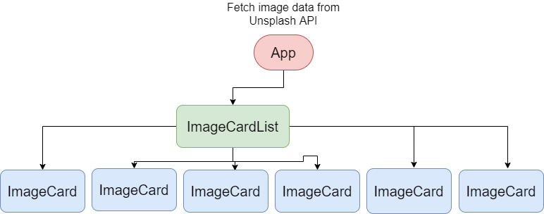

## Unsplash API

[https://unsplash.com](https://unsplash.com)는 다양한 이미지 파일을 제공하는 서비스다. 이 서비스에서 제공되는 모든 이미지 파일은 상업적 및 비상업적으로 이용할 수 있다. 이 서비스는 `https://source.unsplash.com/{data}` 이런 식의 URL로 이미지에 대한 데이터를 가져오거나 unsplash에서 제공하는 API를 나의 프로젝트에 통합시킬 수 있다.

[https://unsplash.com/developers](https://unsplash.com/developers) 이 쪽에서 간단한 회원가입을 통해 API Key를 발급받을 수 있다. 데모 버전은 1시간 당 50번의 요청만 할 수 있다.

비슷한 서비스로 [https://picsum.photos/](https://picsum.photos/)가 있다. 마찬가지로 REST API 형식으로 구성된 API에서 이미지에 대한 데이터를 가져올 수 있다.

이 포스트에서는 **Unsplash API**를 Vue 프로젝트와 통합하여 발급받은 API Key로 데이터를 요청하는 방법을 작성한다.

## Vue 환경설정



위와 같은 컴포넌트 구조로 작성하도록 한다. 처음 접속시 Unsplash API로부터 몇 가지의 이미지 데이터를 요청하고 받은 이미지 데이터를 기반으로 컴포넌트를 구성하고 **Card** 형식으로 뿌려준다.

모든 **ImageCard** 컴포넌트를 감싸는 **ImageCardList** 컴포넌트는 CSS3의 **Grid**로 표시되게 한다. 그리고 행과 열의 간격을 보기좋게 바꾼다.


위와 같은 형태로 이미지가 표시될 수 있도록 한다. **ImageCard** 컴포넌트의 최대 너비는 이미지 3개와 간격을 담을 수 있을만한 크기의 1250px로 지정한다. 각각의 이미지는 400px의 고정 너비를 가진다고 가정한다.

이 레이아웃은 n행 3열로 구성한다. 행은 이미지 더 불러오기(Load More 기능) 등을 사용하여 이미지가 더 불러와질 수 있는 상황을 고려한다.

## Vue로 구현

발급받은 API Key를 `.env` 파일에 저장한다.

```text
VUE_APP_ACCESS_KEY=xxxxxxxxxxxxxxxxxxxxxxxxxxxxxxxxxxxxxxxx
VUE_APP_SECRET_KEY=xxxxxxxxxxxxxxxxxxxxxxxxxxxxxxxxxxxxxxxx
VUE_APP_URL=https://api.unsplash.com/
```

환경변수로 사용할 이름 앞에 `VUE_APP`이 붙어야 사용할 수 있다.

```js
methods: {
  async getRandomImages(count) {
    try {
      const { data } = await this.axios.get(
        process.env.VUE_APP_URL + '/photos/random',
        {
          headers: {
            Authorization: 'Client-ID ' + process.env.VUE_APP_ACCESS_KEY
          },
          params: {
            count
          }
        }
      )
      // Binding data to this component data
      this.images = data
    } catch (error) {
      console.error(error)
    }
  }
}
```

`ACCESS_KEY`를 `Authorization` 헤더에 담아 Client-ID라는 문구와 함께 보낸다. 파라미터로 다양한 변수를 함께 보낼 수 있는데, 여기서는 30개를 가져오기 위해 `count=30`을 url과 함께 보낸다. 응답으로 받은 데이터는 컴포넌트의 데이터로 바인딩한다.

```html
<image-card-list :images="images" />
```

**ImageCardList** 컴포넌트에 응답으로 받은 데이터를 보내준다.

```html
<template>
  <div class="wrapper">
    <div class="heading">
      <h1>Masonry Layout Design Examples</h1>
    </div>
    <div class="cards" v-if="images.length">
      <image-card v-for="image in images" :key="image.id" :image="image" />
    </div>
    <div class="cards-loading" v-else>
      Loading image....
    </div>
  </div>
</template>
```

부모로부터 받은 이미지 데이터로 **ImageCard** 컴포넌트를 여러개 만든다. 부모 컴포넌트에서 아직 데이터를 보내주지 않았다면 'Loading image....' 문구를 보여준다.

**ImageCard** 컴포넌트를 감싸는 `.cards`는 다음과 같이 스타일을 지정한다.

```css
.wrapper .cards {
  display: grid;
  column-gap: 10px;
  row-gap: 7px;
  grid-template-columns: repeat(3, 400px);
  justify-content: center;
  max-width: var(--card-container-width);
}
```

`.cards`는 그리드 레이아웃으로 지정됬고 그 안에 모든 자식들은 그리드 컨테이너의 아이템이 된다. 열과 열 사이의 간격은 `column-gap`으로 지정할 수 있고 위에서는 10px로 지정했다. 행과 행 사이의 간격은 비슷하게 `row-gap`을 사용해서 지정할 수 있다.

`grid-template-columns` 속성을 사용하면 열을 지정할 수 있다. 위에서는 `repeat()` 함수를 이용하여 3개의 열을 만들고 각각의 열 사이즈를 400px로 지정했다. 가변 비율인 `fr` 단위를 사용할 수도 있다.

`justify-content` 같은 속성은 플렉스 레이아웃을 구성했을 때 많이 보던 속성인데, 마찬가지로 그리드에서도 똑같이 사용할 수 있다. 이 경우는 열의 아이템들을 중앙으로 정렬한다. `grid-auto-flow` 속성으로 인해 결과가 바뀔 수가 있다. flex의 `flex-direction` 속성처럼.

```html
<template>
  <div
    class="card"
    :style="{
      height: tH + 'px',
      gridRowEnd: gap,
      backgroundColor: 'gray',
      borderRadius: '10px'
    }"
  >
    <div class="image">
      
    </div>
  </div>
</template>
```

**ImageCard** 컴포넌트의 템플릿은 위와 같이 구성한다. 카드의 높이, 아직 이미지가 불러와지지 않았을 때의 배경색, 테두리 둥글기 등을 미리 지정하고 이미지가 로드됬을 때 함수를 실행해서 이미지를 보여준다.

```js
export default {
  props: {
    image: {
      type: Object,
      required: true
    }
  },

  data: () => ({
    gap: null,
    tH: null
  }),

  created() {
    this.tH = Math.round(this.image.height / (this.image.width / 400))
    const gap = Math.round(this.tH / 10)
    this.gap = `span ${gap}`
  }
}
```

Unsplash API에서 **small** 사이즈의 이미지는 모두 400px로 고정되어 뿌려진다. 높이는 알맞게 조정된다. Masonry Layout을 구성하기 위해서 높이를 사전에 알아야할 필요가 있다.

핵심은, 카드(이미지)의 높이를 사전에 계산해서 행 끝에 위치시키는 `gird-row-end` 속성을 이용한 방법이다. 이 방법을 이용하면 Masonry Layout을 구성할 수 있다. 이 속성의 값은 `span` 키워드를 사용해서 지정한다.

## 완성과 더 해보면 좋을 것들


완성된 이미지다. 부족한 모습이 보이긴 하지만 나름대로 **Masonry Layout**처럼 보인다. 이 레이아웃을 다른 프로젝트 혹은 다른 컴포넌트에서도 재사용하려면 다양한 방법이 있을 것 같다. **directive**를 이용한 방법이나, 컴포넌트를 따로 만든다거나, Github에 이런 레이아웃을 구현해서 [vue와 통합한 라이브러리](https://github.com/shershen08/vue-masonry)가 있으니 참고하면 될 것 같다.


unsplash 공식 홈페이지에 들어가보면 해당 이미지에 마우스를 올렸을 때 다양한 정보를 출력하는 걸 볼 수 있다. 이러한 기능도 재밌게 구현이 가능할 것 같다.

## 참고

- [해당 포스트로 구현된 데모 페이지](https://n2ptune.github.io/masonry-layout-with-vue/)
- [https://github.com/shershen08/vue-masonry](https://github.com/shershen08/vue-masonry)
- [https://unsplash.com/](https://unsplash.com/)
- [https://heropy.blog/2019/08/17/css-grid/](https://heropy.blog/2019/08/17/css-grid/)
